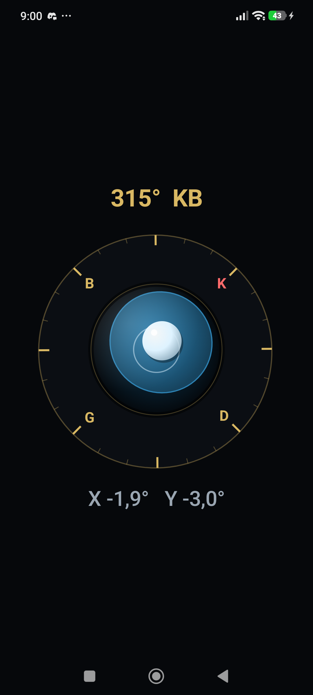
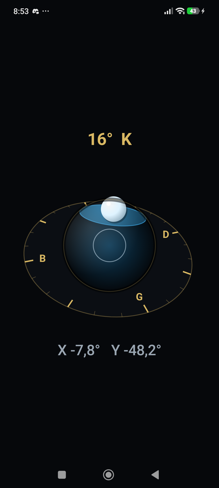
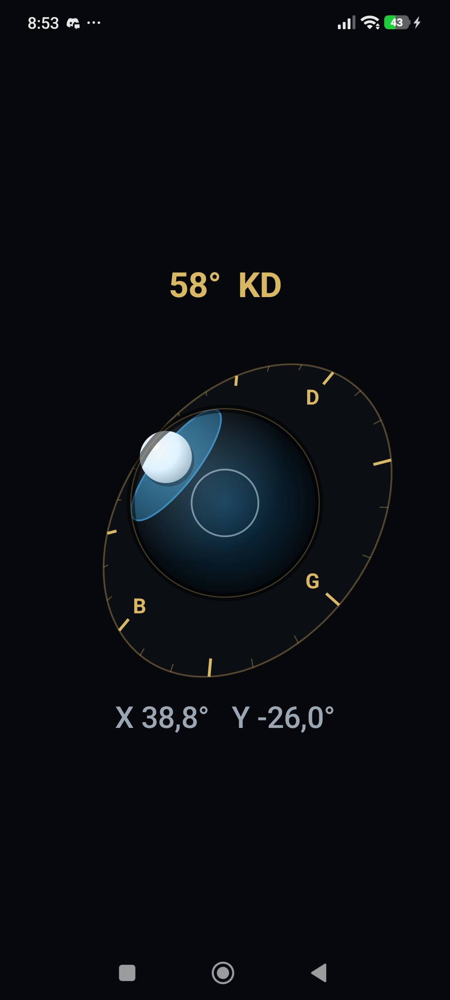

# FlatSurface — 3B Su Terazisi ve Pusula

Android için tek ekranlı su terazisi ve pusula. Ekranın ortasında cam kubbe içindeki
kabarcık telefonun eğimini, çevresindeki kadran bakılan yönü gösterir.

Sahne gerçek 3B'dir: perspektif projeksiyonla çizilir, telefon eğildikçe pusula kadranı
elipse döner ve su yüzeyi kubbenin içinde yatay kalmaya devam eder.

| Düz | Öne eğik | Çapraz eğik |
|---|---|---|
|  |  |  |

## Sahne modeli

Görüntü, üç nesnenin farklı referans sistemlerine bağlanmasından doğar:

| Nesne | Bağlı olduğu sistem | Sonuç |
|---|---|---|
| Pusula kadranı | **Dünya** (yatay düzlem, kuzeye hizalı) | Telefon eğildikçe perspektifte elipse döner, döndükçe kendi ekseninde döner |
| Cam kubbe | **Cihaz** (alet gövdesine takılı vial gibi) | Ekranda hep daire kalır; derinlik gradyan ve kenar gölgesiyle verilir |
| Su yüzeyi | **Dünya yatayı** | Yatay düzlemin küreyi kestiği çember, kubbe içinde kayan bir elips olarak görünür |
| Kabarcık | **Dünya yukarısı** | Kubbe iç yüzeyinde daima yükselen tarafa gider |

Kabarcığın yönü doğrudan yerçekimi vektöründen geldiği için işaret düzeltmesi
içermez — davranış fizikten çıkar.

Gerçek eğim, `gain` katsayısıyla görsel olarak büyütülür (gerçek bir vial'ın büyük
eğrilik yarıçapının karşılığı) ve `maxTilt` ile kubbe kenarında sınırlanır.

## Teknik

- **Kotlin 2.2** + **Jetpack Compose**, Material 3'ten yalnızca `Text`
- **Üçüncü parti bağımlılık yok.** Sensör Android framework'ünden, çizim tek `Canvas`'tan
- Tek sensör: `TYPE_ROTATION_VECTOR` — ivmeölçer, jiroskop ve manyetometreyi cihaz
  tarafında birleştirir, böylece eğim ve pusula yönü tek kaynaktan gelir
- Gradle Kotlin DSL + version catalog, `compileSdk 37`, `minSdk 26`
- Dikey yön kilidi, ölçüm sırasında ekran kapanmaz

Cihazda manyetometre yoksa pusula halkası anlamsız kalır; `TYPE_ROTATION_VECTOR`
hiç yoksa uygulama "Bu cihazda gerekli sensör yok" mesajı gösterir.

## Dosyalar

| Dosya | Sorumluluk |
|---|---|
| `Scene3d.kt` | `Vec3`, dünya→cihaz dönüşümü, perspektif izdüşümü, kabarcık yönü, düzlem-küre kesişimi |
| `Dial.kt` | 3B sahnenin tek `Canvas` üzerinde çizimi |
| `Angles.kt` | Açı yumuşatma (360°/0° sınırında geri sarmaz), tolerans, yön etiketi |
| `MainActivity.kt` | Sensör dinleyicisi, state, ekran yerleşimi |

Açı ve geometri matematiği Compose'dan bağımsız saf fonksiyonlarda durur, bu yüzden
düz JVM testinden çağrılabilir.

## Derleme

```bash
./gradlew testDebugUnitTest assembleDebug
```

Üretilen APK: `app/build/outputs/apk/debug/app-debug.apk`

Sistemde ayrı bir JDK yoksa Android Studio'nun kendi JDK'sı yeterlidir:

```bash
JAVA_HOME="/c/Program Files/Android/Android Studio/jbr" ./gradlew assembleDebug
```

## Telefona kurulum

Android Studio gerekmez; `adb` yeterlidir. Telefonda Geliştirici seçenekleri →
USB hata ayıklama açık olmalı ve USB modu "Dosya aktarımı" seçilmelidir.

```bash
adb install -r app/build/outputs/apk/debug/app-debug.apk
```

Kurulduktan sonra uygulama telefonda bağımsız çalışır; bilgisayara veya kabloya
ihtiyaç duymaz.

`adb devices` cihazı `unauthorized` gösteriyorsa telefondaki izin penceresi
onaylanmamıştır. Liste tamamen boşsa cihaz genelde "veri aktarımı yok" modundadır;
USB modunu değiştirmek çözer.

## Bilinen davranış

Alttaki `X` / `Y` değerleri Android'in `getOrientation` konvansiyonunu izler:

```
pitch = asin(-up.y)      roll = atan2(-up.x, up.z)
```

Bu yüzden **sayının işareti kabarcığın gittiği yönün tersidir** — örneğin `X`
pozitifken kabarcık sola gider, yani yüksek olan sol taraftır. Kabarcığın kendisi
doğrudan yerçekimi vektöründen konumlandığı için her zaman fiziksel olarak doğru
tarafta durur; ters okunan yalnızca sayının işaretidir.

## Testler

12 birim testi, ek kütüphane yok:

- `AnglesTest` — en kısa açı farkı, 359°→1° geçişinde geri sarmama, tolerans sınırı, yön etiketleri
- `Scene3dTest` — izdüşüm ölçeği ve derinlik sırası, kabarcık yönü ve eğim sınırı, küre kesiti yarıçapı, dik taban üretimi

Compose çizimi ve sensör dinleyicisi test edilmez; ikisi de framework davranışıdır.

## Kapsam dışı

Kalibrasyon butonu, tek eksenli şahmerdan modu, ayar ekranı, fizikli sıvı çalkalanması,
imzalı release paketi ve iOS sürümü bu depoda yok.

## Tasarım belgeleri

- [Tasarım dokümanı](docs/superpowers/specs/2026-08-09-3d-su-terazisi-design.md)
- [Uygulama planı](docs/superpowers/plans/2026-08-09-3d-su-terazisi.md)
